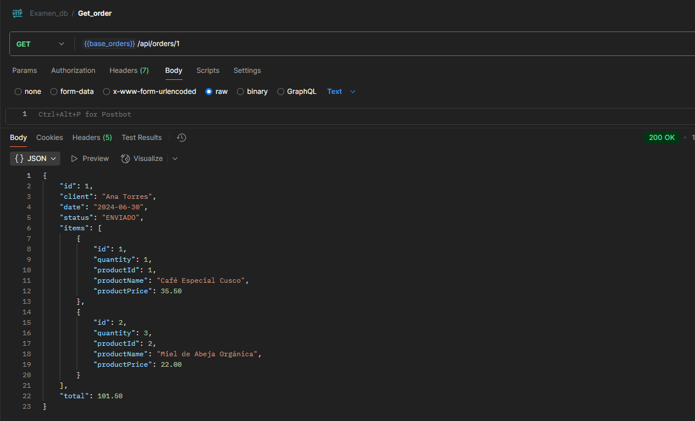
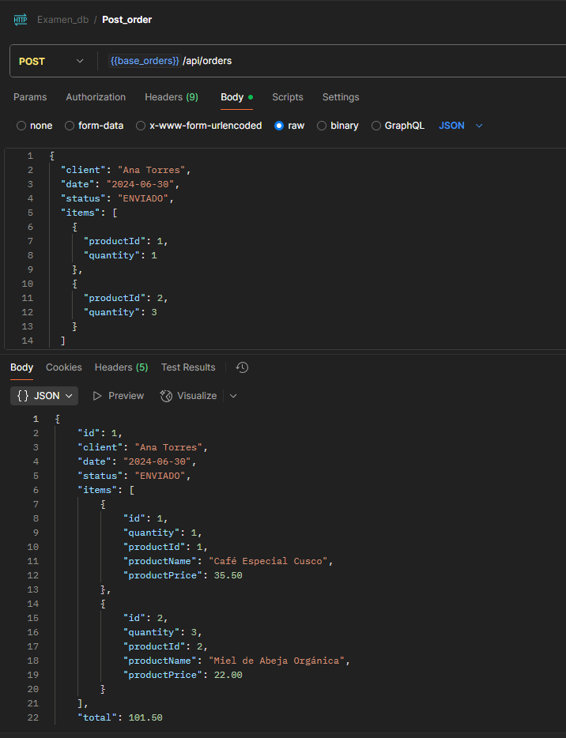

El proyecto se corre a través de este comando: "./mvnw spring-boot:run”

Funcionamiento en Postman

En este microservicio de Órdenes se utiliza el Patrón de Arquitectura en Capas, que divide el sistema en responsabilidades bien separadas, facilitando el mantenimiento, el testeo y la escalabilidad.
Capa de Controlador:
controller/OrderController.java
Controlador REST que gestiona las rutas HTTP y delega la lógica a los servicios.

Capa de Servicio:
service/OrderService.java, service/OrderServiceImpl.java
Implementa la lógica de negocio.

Capa de Acceso a Datos:
repository/OrderRepository.java
Capa de acceso a datos: CRUD y consultas a la base de datos vía JPA.

Capa de Modelo:
model/Order.java, model/OrderItem.java
Entidades que modelan la estructura de los datos y se mapean a la BD.

Capa de DTOs:
dto/OrderDto.java, dto/OrderItemDto.java, dto/ProductDto.java
Objetos de transferencia de datos (DTO) usados para exponer datos de manera estructurada y desacoplada.

Gestión de Excepciones:
Todos los archivos bajo exception/
Gestión centralizada de errores y excepciones personalizadas.

Patrón Cliente HTTP:
client/ProductClient.java
Permite consumir el microservicio de productos, aplicando el patrón Cliente HTTP.
